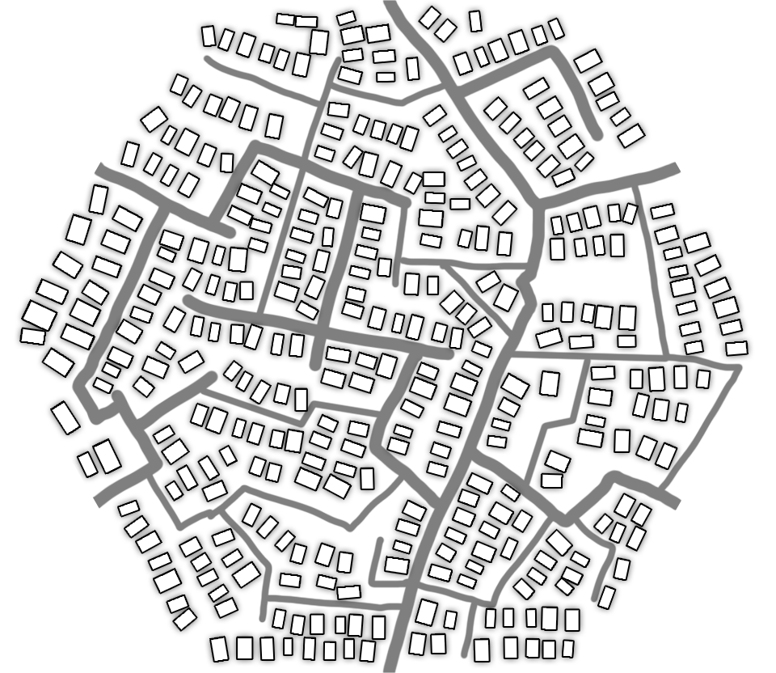

  

  <h1 align="center">Shipping API</h1>

## Overview
Using Open Street map, Taxicab and Nominatim, this API returns geolocation data given two geo-coordinates.

You can retrieve the cost to ship a weightless item from a point to another. You also can see this as the cost of a Uber/99/cabify ride.

## What this API does:
- Linear distance between two points using Haversine method.
- Shortest path between two points.
- Price to ship between two points.
- Tell you where you at.

## Routes:
- Where am I ?
  - ``/whereAmI``
- Shipping Price
  - ``/shipping``
- Linear distance
  - ``/linearDistance``
- Shortest path
  - ``/ShPath``

## Documentation

You can check out the Fast Api built in swagger documentation on route ``/docs``.
